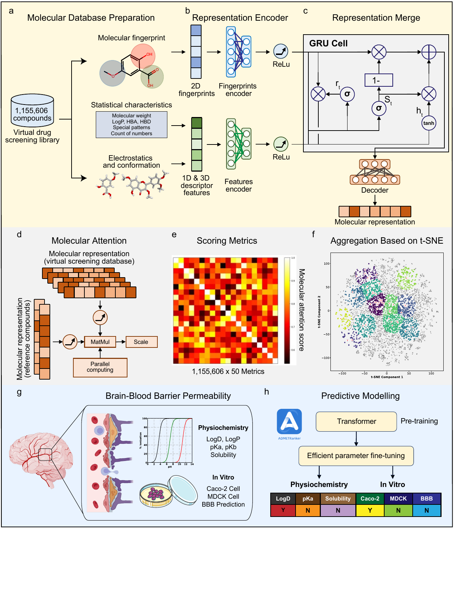

# DeepNeuroprotectiveAutophagyEnhancer (DeepNAE)

DeepNeuroprotectiveAutophagyEnhancer (DeepNAE) provides an end-to-end pipeline for learning molecular representations using a **variational autoencoder (VAE)** with **GRU-based feature fusion**, followed by downstream **diversity analyses**, **ligand-based virtual screening**, and ADMET-based compound prioritization.

If you prefer a hosted workflow, a production deployment is available at:
**[https://deepdrugdiscovery.mindrank.ai/](https://deepdrugdiscovery.mindrank.ai/)**

<p align="center">
  
</p>

---

## 1. System Requirements

### Operating systems

* Tested on **Ubuntu 22.04.4 LTS** (Python 3.10, CUDA 12.1) and **macOS 14.3** (CPU mode).
* The codebase is Python-only and expected to run on other Linux distributions with Python 3.10.

### Key dependencies

* All required packages are listed in `requirements.txt`.

### Hardware

* A **CUDA-enabled GPU** is strongly recommended to accelerate VAE training.
* CPU-only execution is fully supported but slower.

---

## 2. Installation

```bash
conda create -n deepnae python=3.10
conda activate deepnae
pip install -r requirements.txt
```

If conda is unavailable, manually install Python 3.10 and run:

```bash
pip install -r requirements.txt
```

RDKit wheels supporting Linux and macOS are available via PyPI.

---

## 3. Dataset & Pre-Computed Embeddings

The compound library, reference library, pretrained compound embeddings, and reference embeddings are publicly hosted on Figshare:

**Dataset (Figshare):**
[https://figshare.com/articles/dataset/Candidate_Compound_Library_for_DeepNAE_platform/30081430?file=57776389](https://figshare.com/articles/dataset/Candidate_Compound_Library_for_DeepNAE_platform/30081430?file=57776389)

The manuscript’s **ADMET benchmark dataset** is also bundled locally under:

```
ADMET_benchmark/
```

To download and extract the processed dataset:

```bash
mkdir -p data
curl -L -A "Mozilla/5.0" -o data/processed_data.zip https://figshare.com/ndownloader/articles/30081430/versions/2
unzip data/processed_data.zip -d data/processed_data
```

### Key files in `data/processed_data/`:

* `candidate_compounds_library_data.csv`
* `reference_compounds_data.csv`
* `cmp_embeddings.npz`
* `reference_embeddings.npz`

These `.npz` files contain latent vectors generated by `experiments.generate_representation`.
No further preprocessing is required to run the demo or evaluation scripts.

---

## 4. Quick Demo (No Retraining Needed)

1. Ensure the dataset is available inside `data/processed_data/`.
2. Run the virtual screening workflow:

```bash
bash scripts/run_virtual_screening.sh
```

### This script:

* Computes similarity metrics using
  `experiments.generate_similarity_metrics` → produces
  `data/similarity_metrics/sim_mat.npy`
* Runs ligand-based virtual screening through
  `experiments.ligand_based_virtual_screening`

### Expected console output:

```
>>> Compute similarity metrics...
```

followed by confirmation messages indicating that the similarity matrix and screening tables were saved.

---

## 5. Using DeepNAE on Your Own Data

### Step 1 — (Optional) Update configuration

Modify:

```
config/default.yaml
```

to change:

* latent size
* learning rate
* batch size
* device (CPU/GPU)
* architecture parameters

### Step 2 — Prepare SMILES input

Prepare two CSV files matching the schema of the provided datasets.
Your files must include:

```
Smiles_unify
```

Place them in:

```
data/processed_data/
```

### Step 3 — Train the VAE & regenerate embeddings (only if needed)

```bash
bash scripts/run_train_vae.sh
```

This wraps:

* `experiments.train_representation`
* `experiments.generate_representation`

Outputs:

* Model checkpoints → `model_checkpoints/Molecular_VAE_Representation/`
* Embeddings → `data/processed_data/*.npz`

### Step 4 — Run evaluation analyses

```bash
bash scripts/run_evaluation.sh
```

Runs:

* `experiments.evaluate_reconstruction`
* `experiments.diversity_analysis`
* `experiments.compound_diversity`
* `experiments.leave_one_out`

Outputs saved in:

* `history/`
* `plot/`

### Step 5 — Run ligand-based virtual screening

```bash
bash scripts/run_virtual_screening.sh
```

### Step 6 — ADMET prediction

For triaging top-ranked compounds, submit them to the
**MindRank ADMET Ranker**:

[https://admet.mindrank.ai/](https://admet.mindrank.ai/)

The manuscript’s ADMET benchmark dataset is already provided under
`ADMET_benchmark/`, allowing immediate reproduction of the evaluation pipeline.

---

## 6. Reproducing Manuscript Results

Follow these steps to replicate the results described in the manuscript:

1. Install dependencies and download the dataset/embeddings.

2. Run ligand-based virtual screening:

   ```bash
   bash scripts/run_virtual_screening.sh
   ```

3. Run the evaluation suite:

   ```bash
   bash scripts/run_evaluation.sh
   ```

4. Collect results from:

   * `model_checkpoints/Molecular_VAE_Representation/`
   * `history/`
   * `plot/`
   * `data/similarity_metrics/`
   * `ADMET_benchmark/`

5. (Optional) Submit the ranked compounds (or those from `ADMET_benchmark/`) to:
   **[https://admet.mindrank.ai/](https://admet.mindrank.ai/)**
   to reproduce ADMET prediction tables.

6. **(Optional) Cloud-based reproduction**
   You may also replicate similar results end-to-end through the hosted DeepNAE production platform: **[https://deepdrugdiscovery.mindrank.ai/](https://deepdrugdiscovery.mindrank.ai/)**
   This deployment uses the same pretrained models and back-end infrastructure as the manuscript.

---

## 7. License

**MIT License**

For methodological details, theoretical formulations, and pseudocode, refer to the *Methods* section of the manuscript as well as inline comments throughout the `experiments/` and `trainers/` modules.
